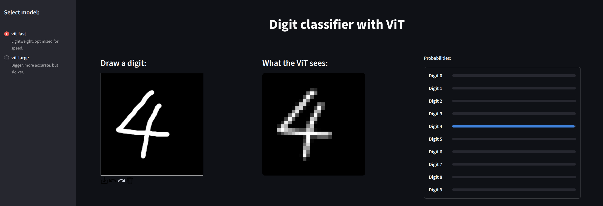
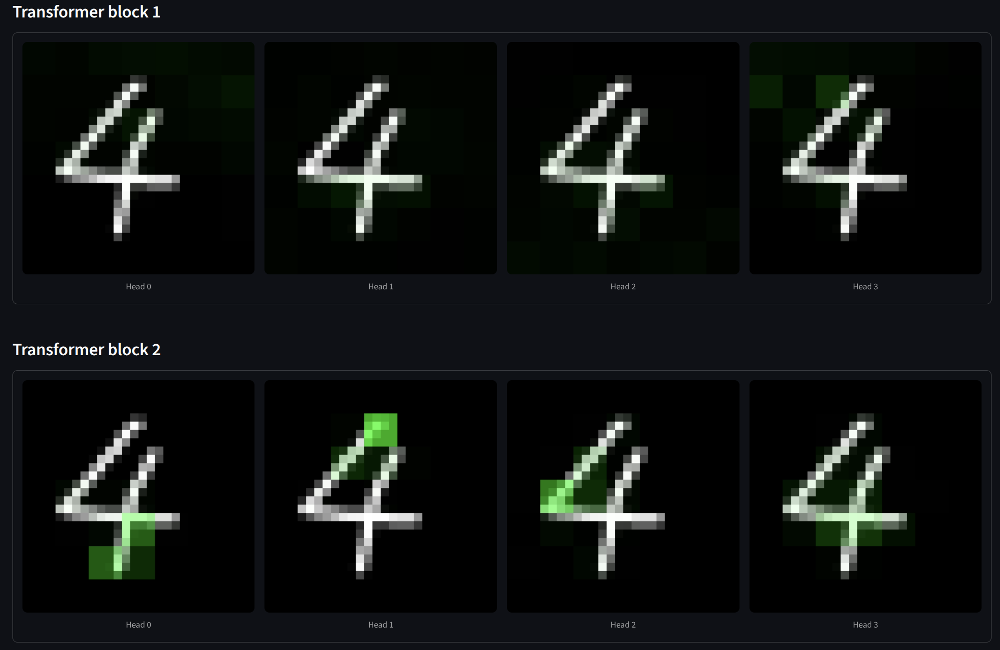

# Digit Classifier with Vision Transformer (ViT)

## Introduction
This repository contains a custom implementation of a Vision Transformer (ViT) designed for handwritten digit classification on the MNIST dataset. The project demonstrates the full machine learning lifecycle: from building a Transformer architecture from scratch in PyTorch, to optimizing hyperparameters via grid search, benchmarking inference latency, and deploying the final model as an interactive web application using Streamlit and ONNX Runtime.



## Technical Architecture

### Model Implementation
The Vision Transformer is implemented entirely from scratch without reliance on high-level model libraries like `timm`. The architecture follows the standard ViT design adapted for small-scale inputs (28x28 MNIST images).

Key components include:
* **Image Encoder:** Implements patch embedding using strided convolutions. Given the small input resolution, a patch size of 4x4 is used to ensure sufficient sequence length.
* **Transformer Block:** A pre-norm residual block consisting of Multi-Head Self-Attention (MHSA) and a Multi-Layer Perceptron (MLP).
* **Attention Mechanism:** A custom MHSA module that not only computes self-attention but also extracts attention maps specifically for the Classification (CLS) token to visualize model focus.
* **Positional Embeddings:** Learnable additive embeddings to retain spatial information.

### Attention Map Generation
The visualization features in the deployed application rely on extracting internal attention weights from the Transformer blocks. The process is as follows:

1. **Extraction:** During the forward pass, the model captures the raw attention matrix ($A$) from the Multi-Head Self-Attention (MHSA) mechanism.
2. **CLS Token Focus:** I specifically isolate the first row of the attention matrix. This row corresponds to the Classification (CLS) token acting as the "query" and all image patches acting as "keys." This effectively measures how much importance the model assigns to each specific patch when forming its final representation.
3. **Filtering:** The self-attention score of the CLS token to itself is discarded to isolate only the visual features.
4. **Reshaping:** The remaining attention scores, which exist as a flat sequence (e.g., 49 scores for a 7x7 grid), are reshaped back into 2D spatial dimensions.
5. **Overlay:** In the application, these low-resolution attention grids are upscaled using nearest-neighbor interpolation and blended onto the original image as a green alpha layer, allowing users to see exactly which strokes contributed to the prediction.

### Optimization and Grid Search
To identify the optimal trade-off between model size, accuracy, and inference latency, a comprehensive grid search was performed. The training pipeline utilizes `sklearn.model_selection.ParameterGrid` to iterate over various configurations:
* **Embedding Dimensions:** [64, 128, 256]
* **Attention Heads:** [2, 4]
* **Transformer Layers:** [1, 2, 3]
* **MLP Ratios:** [2, 4]

Training was tracked using Weights & Biases (W&B) to monitor validation loss, accuracy, precision, recall, and F1-score.

**W&B Report:** [Here!](https://api.wandb.ai/links/eugenio-deluca/i8frhlq1)

### Inference Optimization
Post-training, models are exported to ONNX (Open Neural Network Exchange) format. The evaluation pipeline benchmarks the models to quantify the efficiency gains of the ONNX Runtime (CPUExecutionProvider) versus standard PyTorch inference. This ensures the final deployment is optimized for low-latency CPU environments.

## Streamlit Application
The deployed application allows users to draw digits in real-time and observe the model's predictions.

**Features:**
* **Interactive Canvas:** Users draw digits directly in the browser.
* **Real-time Preprocessing:** Inputs are resized and normalized to match the training distribution (MNIST mean/std).
* **Attention Visualization:** The app overlays the attention maps from the CLS token onto the input image, providing explainability by highlighting which parts of the stroke the model focused on to make a prediction.
* **Model Selection:** Users can toggle between a "Fast" model (optimized for speed) and a "Large" model (optimized for accuracy).



## Project Structure

* `app.py`: The entry point for the Streamlit application.
* `custom_modules/`: Contains the PyTorch implementation of the ViT components (`vision_transformer.py`, `transformer_block.py`, `attention_module.py`, `image_encoder.py`).
* `grid_search_mnist.py`: The main training script handling data loading, training loops, evaluation, ONNX export, and W&B logging.
* `param_grid.json`: Configuration file defining the hyperparameter search space.

## Installation and Usage

This project manages dependencies using `pipreqs`. There are two separate requirement files depending on your use case.

### 1. For Deployment (Streamlit App)
If you only wish to run the web application:

```bash
pip install -r requirements.txt
streamlit run app.py
```

### 2. For Development (Training & Grid Search)
If you intend to retrain the models, run the grid search, or modify the architecture, you need the full development environment (including PyTorch, W&B, and Scikit-learn):

```bash
pip install -r requirements-dev.txt
python grid_search_mnist.py
```

## License

MIT License